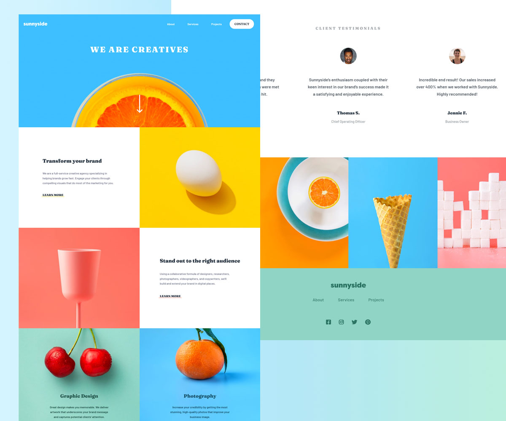
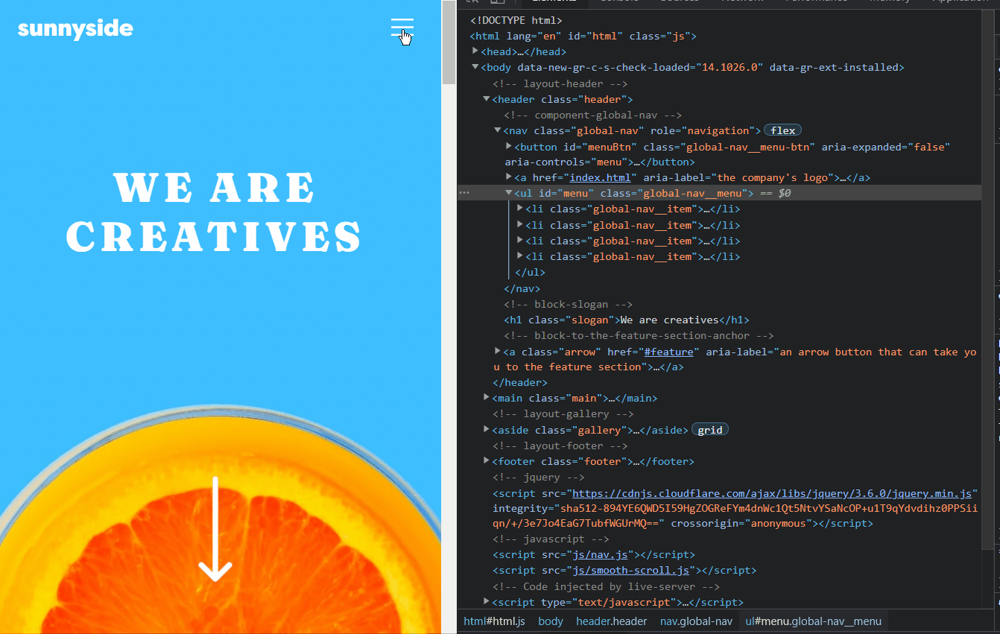
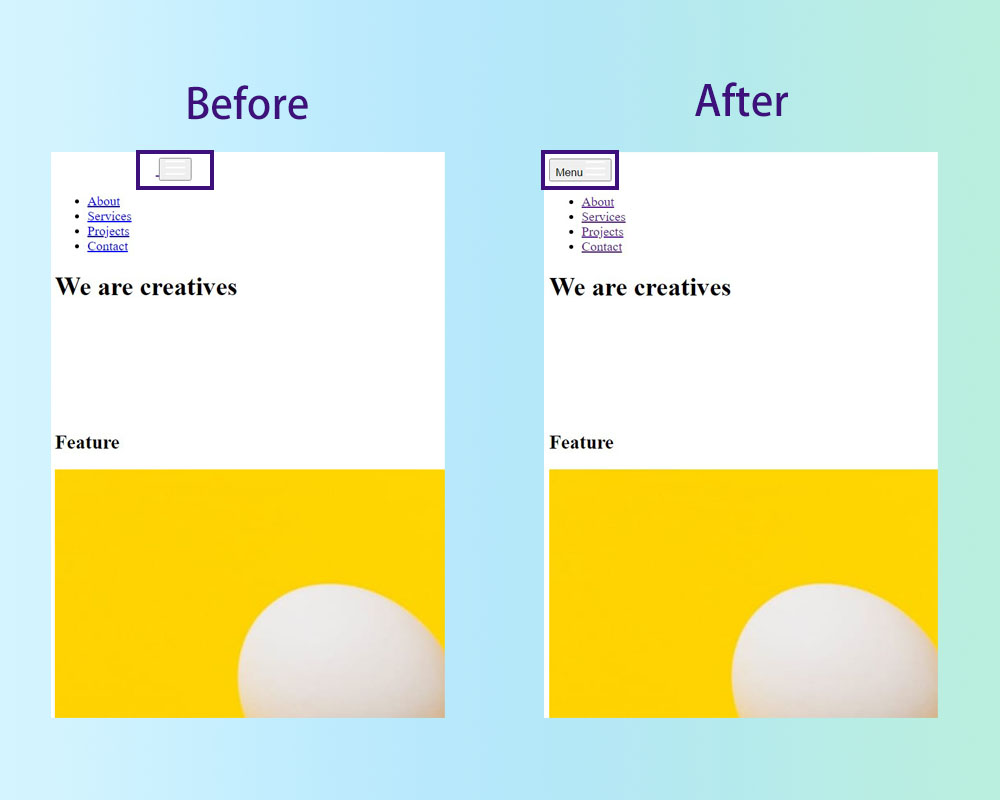
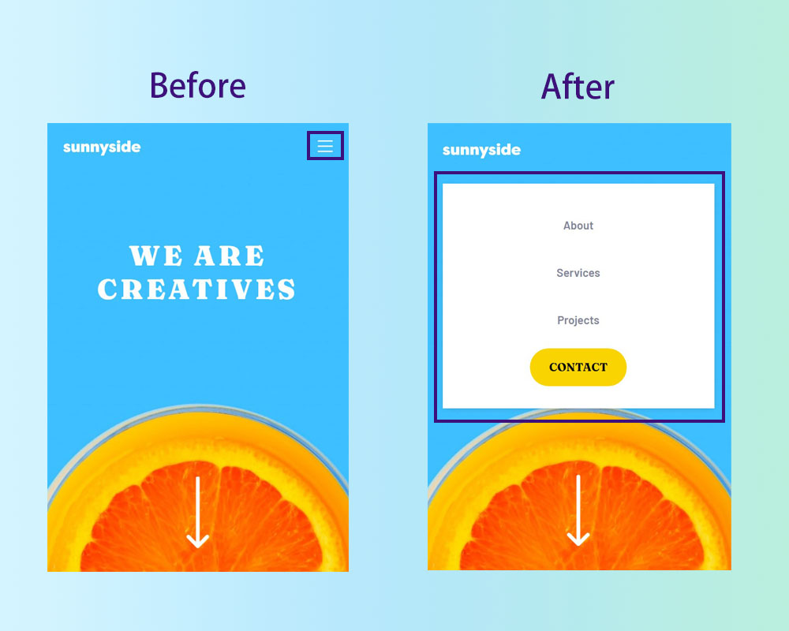
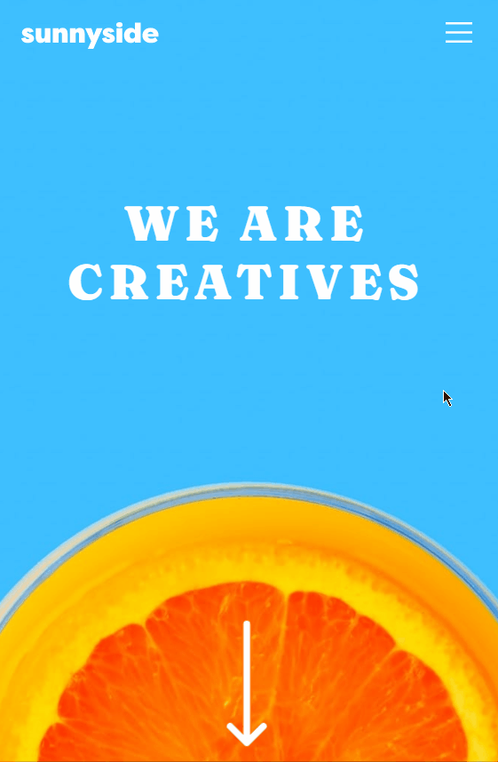
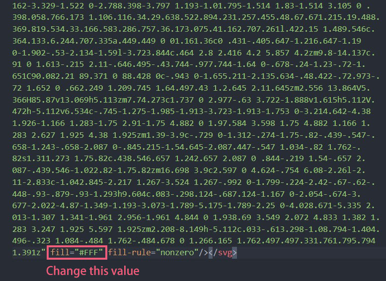
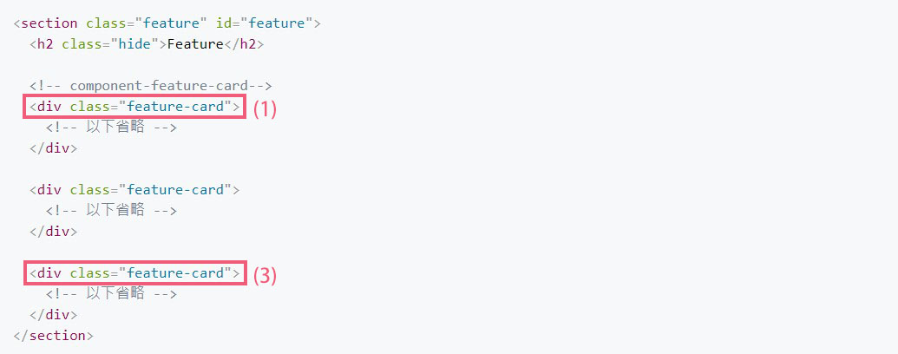
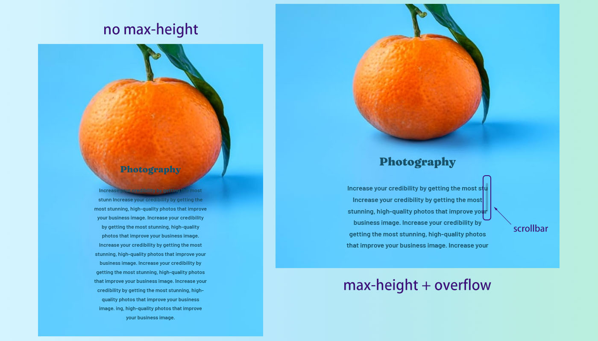

# Frontend Mentor - Sunnyside agency landing page

這是來自[Sunnyside agency landing page challenge on Frontend Mentor](https://www.frontendmentor.io/challenges/sunnyside-agency-landing-page-7yVs3B6ef)的解答。  
Frontend Mentor challenges 是一個藉由實際建立專案，來提升 coding 技術的挑戰。

## 大綱

- [總覽](#總覽)
  - [關於這份挑戰](#關於這份挑戰)
  - [螢幕截圖](#螢幕截圖)
  - [網站連結](#連結)
- [工作流程](#工作流程)
  - [使用的工具](#使用的工具)
  - [架構圖](#架構圖)
- [更新紀錄](#更新紀錄)
- [我學到什麼](#我學到什麼)
- [特色](#特色)
- [問題回報](#問題回報)
- [關於作者](#關於作者)
- [致謝](#致謝)
- [參考資料](#參考資料)

## 總覽

### 關於這份挑戰

你的挑戰是建立出這個引導頁面（langing page），盡你所能的讓它能夠看起來越接近設計稿越好。

這個挑戰主要聚焦在 HTML 和 CSS，以及一小部分的 JS（手機板的導覽區塊）。  
關於 JS 的部分，你可以自己選擇是否要完成。

你可以使用任何你喜歡的工具來完成這份挑戰。所以如果你有某個你想要練習的工具，就盡管去嘗試吧！

提示－你的使用者應該要能夠：

- 在他們裝置上得到最佳化的佈局
- 從互動式元件上獲得 "互動（interactive）" 的效果 <font size="2">（連結按鈕）</font>

### 螢幕截圖

**🖥 桌機版：**



**📱 手機版：**


### 連結

- Live Site URL: [Here](https://jubeatt.github.io/Sunnyside-agency-landing-page/)🥑

## 工作流程

### 使用的工具

- Mobile-first workflow
- Semantic HTML5 markup
- Flex-box
- Grid-box
- @keyframe (箭頭動畫)
- SCSS (preprocessor)
- BEM (methodology)
- Vanilla JavaScript (導覽列開關)
- [Reset.css](https://meyerweb.com/eric/tools/css/reset/)
- [jQuery](https://jquery.com/) (平滑滾軸)
- [Google font](https://fonts.google.com/)
- [Font Awesome](https://fontawesome.com/v5/changelog/latest) (社群圖示)

### 架構圖


## 更新紀錄

**2021/08/18**

### 重新調整 HTML 結構

原始：

```html
<!-- layout-header -->
<header class="header">
  <!-- block-navigation -->
  <div class="navigation">
    <!-- block-logo -->
    <a href="index.html">
      
    </a>
    <!-- block-hamburger -->
    <button class="hamburger" id="menuBtn">
      
    </button>

    <!-- component-global-nav -->
    <nav class="global-nav" id="menu">
      <ul class="global-nav__menu">
        <!-- menu-item -->
      </ul>
    </nav>
  </div>
  <!-- omission -->
</header>
```

注意到幾個問題：

**關於`<button>`**

- `<button>`被放置在`<nav>`外面，這樣子的問題是`Screen Reader(螢幕閱讀器)`無法識別出`<button>`與`<nav>`之間的關聯性，所以唸出來的內容就會比較含糊。

- `<button>`沒有包含`Menu`文字，這樣的話使用者就不知道這個按鈕是做什麼用的。

- `<button>`中沒有添加`aria-expanded`屬性，所以使用者無法知道目前的內容是展開還是閉合的。

- `<button>`中沒有添加`aria-controls`屬性，所以使用者無法知道這個按鈕是用來控制什麼東西的。

**關於`<nav>`**

- `<nav>`沒有設定`role="navigation"`屬性，所以對於那些不認得`<nav>`標籤的`瀏覽器`或`Screen Reader(螢幕閱讀器)`來說會是一個問題。

- 此處的 JavaScript 是透過`<nav>`來顯示與隱藏導覽清單，這樣子當`<nav>`沒有被顯示出來時，`Screen Reader(螢幕閱讀器)`在掃描`landmarks(地標標籤)`的時候是無法讀取到`<nav>`的，所以此時使用者就會不知道有你的網站有導覽功能。

針對以上這些問題來重新調整 HTML 的結構，如下所示：

```html
<!-- layout-header -->
<header class="header">
  <!-- component-global-nav -->
  <nav class="global-nav" role="navigation">
    <!-- block-menu-button -->
    <button
      id="menuBtn"
      class="global-nav__menu-btn"
      aria-expanded="false"
      aria-controls="menu"
    >
      <span class="hide">Menu</span>
      
    </button>

    <a href="index.html" aria-label="the company's logo">
      
    </a>

    <!-- block-menu -->
    <ul id="menu" class="global-nav__menu">
      <!-- menu-item -->
    </ul>
  </nav>

  <!-- omission -->
</header>
```

重新檢視原本的問題：

**關於`<button>`**

- `<button>`現在放在`<nav>`裡面，`Screen Reader(螢幕閱讀器)`能夠識別出`<button>`與`<nav>`之間的關聯性

- `<button>`現在有`Menu`文字，使用者可以很清楚知道這是一個選單的按鈕。

- `<button>`中添加了`aria-expanded`屬性，現在使用者知道目前選單的內容是展開還是閉合。

- `<button>`中添加了`aria-controls`屬性，現在使用者知道這個按鈕是用來控制選單的內容。

**關於`<nav>`**

- `<nav>`現在設定了`role="navigation"`屬性，所以即便`瀏覽器`或`Screen Reader(螢幕閱讀器)`不認得`<nav>`標籤，也能從這個屬性得知這是一個導覽列。

- 此處的重新調整 JavaScript，控制`<ul>`來打開和關閉導覽選單，而不是`<nav>`，所以不會有`landmark`消失的問題，同時也控制`<button>`中的`aria-expanded`屬性值，讓按鈕隨著開關狀態的改變來同步更新。

這裡提供一個簡單的演示：

<font size="2">💡 註：注意此時是`<ul>`被控制，且`<button>`中的`aria-expanded`會隨著改變。</font>



對 JavaScript 的部分有興趣的人可以參考：

```javascript
// get element
let menuBtn = document.getElementById('menuBtn')
let menu = document.getElementById('menu')

// event binding
menuBtn.addEventListener('click', toggleMenu, false)

// turn on / off the menu
function toggleMenu() {
  // if the menu is active
  if (menu.classList.contains('global-nav__menu--active')) {
    // set aria-expanded of the button to false
    this.setAttribute('aria-expanded', 'false')
    // open the menu
    menu.classList.remove('global-nav__menu--active')
  } else {
    // set aria-expanded of the button to true
    this.setAttribute('aria-expanded', 'true')
    // close the menu
    menu.classList.add('global-nav__menu--active')
  }
}
```

### 採用漸進式增強設計模式

為了確保使用者在沒有 CSS 與 JavaScript 時，也能擁有一定的使用體驗，這裡採用了漸進式增強的設計模式。

這裡直接帶各位看修正前與修正後的對照：

**HTML only**



- 在沒有採取漸進式增強之前，使用者只會看到一個顯示`☰`的`<button>`

- 採取漸進式增強之後，使用者能夠看到一個帶有`menu`文字的`<button>`

**HTML, CSS**



- 在沒有採取漸進式增強之前，使用者只會看到一個放了`☰`的`<button>`，但現在 js 無法控制，所以這個`☰`沒有任何作用，使用者也無法進行導覽。

- 採取漸進式增強之後，使用者會直接看到導覽清單的內容。（這部分可以再利用設計做出更好一點的畫面，但至少我們的使用者現在能夠進行導覽功能）

**HTML, CSS, JavaScript**



當所有功能俱全後，就如我們的最終設計一樣，使用者能看到很好的畫面，按鈕也能夠正常控制導覽列的閉合。

以上就是漸進式增強的大致理念，基本上都是參考[這篇文章](https://www.a11ymatters.com/pattern/mobile-nav/)來設計的，有興趣的人建議可以到裡面看看，作者解釋的很清楚。

## 我學到什麼

### 關於 BEM 的 class 結構

- **複雜的巢狀結構**

這裡引用來自[BEM by Example](https://sparkbox.com/foundry/bem_by_example)的一段敘述：

> If your component has child elements several levels deep, don’t try to represent each level in the class name. BEM is not intended to communicate structural depth. A BEM class name representing a child element in the component should only include the base/block name and the one element name.

意思是說，假使一個 component 下有多個層級的子元素，我們也不必在 BEM 把每一層的結構寫出來，譬如說：

```html
<figure class="photo">
  
  <figcaption class="photo__caption">
    圖片解說
    <blockquote class="photo__caption__quote">
      不要在一個class裡面放一個以上的element
    </blockquote>
  </figcaption>
</figure>
```

所以一個`Block`下最多只會寫一層`Element`：

```html
<figure class="photo">
  
  <figcaption class="photo__caption">
    圖片解說
    <blockquote class="photo__quote">這樣就對了</blockquote>
  </figcaption>
</figure>
```

即便你沒有把每一個層級都寫出來，也能夠看出`img`, `caption`, `quote`都是`photo`這個 component 下的元素。

所以只要掌握住一個原則：**這個元素是哪個 component 下的元素**，就能寫出簡潔清楚的 class 名稱。

- **有些元素不需要綁在 Block 上**

拿這個挑戰中的`header`部分來舉例：

```html
<header class="header">
  <h3 class="slogan">WE ARE CREATIVES</h3>
  <a class="arrow"></a>
</header>
```

`slogan`跟`arrow`這兩個元素其實都能獨自存在，並沒有一定要綁在`header`這個`Block`上（除非你把整個`header`當成是一個 component），所以就不建議這樣子寫：

```html
<header class="header">
  <h3 class="header__slogan">WE ARE CREATIVES</h3>
  <a class="header__arrow"></a>
</header>
```

這種情況大多會發生在文字的部分，所以這種時候就建議寫一個方便識別的 class 就好，不用一定要照著 BEM 的規則來命名。

### picture 標籤的運用

要製作響應式圖片，並不是只能透過`media query`來實現，也可以使用 HTML 中的`<picture>`。

譬如，在這個挑戰中的圖片就能這樣使用：

```html
<picture>
  <source
    srcset="images/desktop/image-transform.jpg"
    media="(min-width: 760px)"
  />
  
</picture>
```

瀏覽器會先從`<source>`找尋有沒有匹配條件的圖片，如果沒有的話（或瀏覽器不支援`<picture>`）就會使用``所設定的圖片。

補充：

- `<source>`可以有很多個。
- ``一定要寫在最後面，寫在``後面的`<source>`都會被省略。

更多詳細的內容可以參考：[這裡](https://www.fooish.com/html/picture-tag.html)

### SVG 的相關設定

由於我以前沒用過 SVG 來設定圖片，所以不太清楚 SVG 的一些設定該怎麼調整，這裡會把我碰到的問題列出來。

拿挑戰中的這個 SVG 來舉例：


- **改變 SVG 的尺寸**

只要用 CSS 直接去選取這個 SVG 來做設定即可：

```html

```

```scss
.logo {
  width: 150px;
}
```

- **改變 SVG 的顏色**

我目前知道的做法有兩種：

1. 直接去修改 svg 檔案中的 `fill` 屬性值。



2. 把 svg 檔案寫入 HTML 中，再透過 CSS 來調整`fill`的屬性值。

```html
<svg width="124" height="24" xmlns="http://www.w3.org/2000/svg">
  <path
    d="M5.857 18.708c1.638 0 2.995-.36 4.07-1.08 1.075-.721 1.613-1.769 1.613-3.144-.083-1.855-1.464-3.246-4.144-4.173l-1.44-.597c-.314-.1-.538-.198-.67-.298a.45.45 0 01-.198-.373c0-.414.273-.62.819-.62.678 0 1.182.347 1.513 1.043l3.698-1.044c-.893-2.22-2.614-3.329-5.162-3.329-1.522 0-2.788.398-3.797 1.193C1.15 7.08.645 8.116.645 9.39c0 .398.058.766.174 1.106.116.34.29.638.521.894.232.257.455.48.67.671.215.19.488.369.82.534.33.166.582.286.756.36.174.075.41.162.707.261l.422.15 1.49.546c.363.133.6.244.707.335a.449.449 0 01.16.36c0 .431-.404.647-1.215.647-1.191 0-1.903-.53-2.134-1.59L0 14.509c.463 2.8 2.416 4.2 5.857 4.2zm11.636 0c1.638 0 2.845-.63 3.623-1.888v1.615h5.112V5.366h-5.112v7.156c0 1.474-.505 2.21-1.514 2.21-1.026 0-1.539-.736-1.539-2.21V5.366h-5.112v7.653c0 3.793 1.514 5.69 4.542 5.69zm16.103-.273V11.28c0-1.475.504-2.212 1.513-2.212 1.026 0 1.54.737 1.54 2.212v7.155h5.111v-7.652c0-3.793-1.513-5.69-4.541-5.69-1.638 0-2.846.63-3.623 1.888V5.366h-5.113v13.069h5.113zm15.383 0V11.28c0-1.475.504-2.212 1.514-2.212 1.025 0 1.538.737 1.538 2.212v7.155h5.113v-7.652c0-3.793-1.514-5.69-4.542-5.69-1.638 0-2.846.63-3.623 1.888V5.366h-5.113v13.069h5.113zM64.958 24l8.289-18.634H67.91l-2.532 6.684-2.258-6.684h-5.584l5.435 11.802L59.944 24h5.014zm13.67-5.292c1.638 0 2.995-.36 4.07-1.08 1.076-.721 1.614-1.769 1.614-3.144-.083-1.855-1.465-3.246-4.145-4.173l-1.44-.597c-.314-.1-.537-.198-.67-.298a.45.45 0 01-.198-.373c0-.414.273-.62.819-.62.678 0 1.183.347 1.514 1.043l3.698-1.044c-.894-2.22-2.614-3.329-5.162-3.329-1.522 0-2.788.398-3.797 1.193-1.01.795-1.514 1.83-1.514 3.105 0 .398.058.766.173 1.106.116.34.29.638.522.894.231.257.455.48.67.671.215.19.488.369.819.534.33.166.583.286.757.36.173.075.41.162.707.261l.422.15 1.489.546c.364.133.6.244.707.335a.449.449 0 01.161.36c0 .431-.405.647-1.216.647-1.19 0-1.902-.53-2.134-1.59l-3.723.844c.464 2.8 2.416 4.2 5.857 4.2zm9.8-14.137c.91 0 1.613-.215 2.11-.646.495-.43.744-.977.744-1.64 0-.678-.24-1.23-.72-1.651C90.082.21 89.371 0 88.428 0c-.943 0-1.655.211-2.135.634-.48.422-.72.973-.72 1.652 0 .662.249 1.209.745 1.64.497.43 1.2.645 2.11.645zm2.556 13.864V5.366H85.87v13.069h5.113zm7.74.273c1.737 0 2.977-.63 3.722-1.888v1.615h5.112V.472h-5.112v6.534c-.745-1.275-1.985-1.913-3.723-1.913-1.753 0-3.214.642-4.38 1.926-1.166 1.283-1.75 2.91-1.75 4.882 0 1.97.584 3.598 1.75 4.882 1.166 1.283 2.627 1.925 4.38 1.925zm1.39-3.9c-.729 0-1.312-.274-1.75-.82-.439-.547-.658-1.243-.658-2.087 0-.845.215-1.54.645-2.087.447-.547 1.034-.82 1.762-.82s1.311.273 1.75.82c.438.546.657 1.242.657 2.087 0 .844-.219 1.54-.657 2.087-.439.546-1.022.82-1.75.82zm16.698 3.9c2.597 0 4.624-.754 6.08-2.26l-2.11-2.833c-1.042.845-2.217 1.267-3.524 1.267-.992 0-1.799-.224-2.42-.67-.62-.448-.93-.879-.93-1.293h9.604c.083-.298.124-.687.124-1.167 0-2.054-.674-3.677-2.022-4.87-1.349-1.193-3.073-1.789-5.175-1.789-2.25 0-4.028.671-5.335 2.013-1.307 1.341-1.961 2.956-1.961 4.844 0 1.938.69 3.549 2.072 4.833 1.382 1.283 3.247 1.925 5.597 1.925zm2.208-8.149h-5.112c.033-.613.298-1.08.794-1.404.496-.323 1.084-.484 1.762-.484.678 0 1.266.165 1.762.497.497.331.761.795.794 1.391z"
    fill="#FFF"
    fill-rule="nonzero"
  />
</svg>
```

```scss
svg path {
  fill: pink;
}
```

### nth-child 跟 nth-of-type 的差異

為了做出這個效果：


這裡的想法是去修改**第奇數個項目的元素**，所以會需要用到`nth-child`或`nth-of-type`來實作。

不過在我的案例中，只能用`nth-of-type`來實作，因為我的 HTML 長這樣：

```html
<section class="feature" id="feature">
  <h2 class="hide">Feature</h2>

  <!-- component-feature-card-->
  <div class="feature-card">
    <!-- 以下省略 -->
  </div>

  <div class="feature-card">
    <!-- 以下省略 -->
  </div>

  <div class="feature-card">
    <!-- 以下省略 -->
  </div>
</section>
```

如果我這樣子寫：

```scss
.feature-card:nth-child(odd) {
  ...
}
```

實際會選取到的是：


但如果是：

```scss
.feature-card:nth-of-type(odd) {
  ...
}
```

實際會選取到的是：



有一個很重要的地方是，不管是`nth-child`還是`nth-of-type`，**兩者都是從同階層中的標籤來做選取，不是 class**。

而這兩者唯一的差異在於：

- nth-child：同階層中的**所有標籤**
- nth-of-type：同階層中的**相同標籤**

所以下次在使用時要特別注意同階層中的標籤關係。

### 什麼時候該把單位設為%

由於自己做響應式網站的經驗還不算多，所以會分不太清楚什麼時候該使用相對單位，什麼時候該使用絕對單位比較適合，以下是我完成這份挑戰後得出的一些心得：

- 通常會隨著寬度來做改變的區塊，應該要將其`width`設為%。

- 關於文字或區塊之間的 `margin`，`padding` 則要視情況，如果設為%，則當寬度越大的時候，文字或區塊之間的間距也會跟著逐漸變大，所以這部分要自己斟酌。

- 有些區塊的 `padding`，一樣，如果四個邊都有設 `padding`，那就要考慮到，當寬度越寬的時候，這個區塊的內容就會越往裡面推，所以要考慮**內容本身會不會隨著寬度增加而變大**？如果不會，那差距就隨著寬度會越來越大。

- 如果希望一個區塊的`width`, `height`會隨著視窗增加的時候，或許就需要設%。

### 更具彈性化的文字設定

可以善用 `max-width / max-height` 來限制文字的最大或最小寬度，來避免當區塊太大或太小時，降低文字的美觀與可讀性，或者是反過來，過多的文字影響到整個區塊的寬度或高度。

範例一：

<font size="2">💡 註：圖片是在寬度`759px`擷取的（手機板的最大寬度）</font>


範例二：

<font size="2">💡 註：圖片是在寬度`759px`擷取的（手機板的最大寬度）</font>



### 使用 object-fit 避免圖片變形

這裡不囉嗦，直接先看圖：

<font size="2">💡 註：圖片是在寬度`765px`擷取的</font>


`object-fit` 是在 CSS3 新增的屬性，詳細的用法可以參考[這裡](https://tools.wingzero.tw/article/sn/61)

<font size="2">⚠ 注意：IE 不支援這個屬性。</font>

## 特色

### 不限字數的內容

我在部分的內容區塊使用了`max-height`與`overflow`，所以即便內容較多也不用擔心。


原始碼：

```scss
&content {
  max-height: 400px;
  overflow: auto;
}
```

### 自定義 scrollbar

瀏覽器預設的滾軸似乎不是那麼好看（我覺得啦 😅），所以這部分其實也能透過 CSS 來設定樣式。


<font size="2">⚠ 注意：此方法僅適用於 Webkit 瀏覽器（Chrome or Safari），若有跨瀏覽器的需求，建議使用 JavaScript。</font>

原始碼：

```scss
&::-webkit-scrollbar-track {
  border-radius: 10px;
  background-color: transparent;
}

&::-webkit-scrollbar {
  width: 8px;
  background-color: transparent;
}

&::-webkit-scrollbar-thumb {
  border-radius: 10px;
  background-color: #555;
}
```

如果想了解更多的話，你也可以參考這個[網站](https://cssdeck.com/labs/css3-webkit-vertical-scrollbars)

### 平滑滾軸效果


如果想簡單快速的話，可以直接使用 CSS 中的`scroll-behavior: smooth`這個屬性，如下：

```scss
html {
  scroll-behavior: smooth;
}
```

<font size="2">⚠ 注意：此方法不適用於 Safari 及 IE</font>

如果要考慮瀏覽器的支援度的話，建議還是使用 JavaScript 來實作會比較穩固。

這邊是搭配 jQuery 來使用，因為 jQuery 在處理動畫的部分會比較輕鬆一些，不過如果你想要用原生 JavaScript 也不是不行？（只要有愛就沒問題了？😂）

原始碼：

```javascript
// get element
let arrowBtn = $('.arrow')
// except the "logo" anchor and the "arrow" anchor
let link = $('a[href="#"]:not(".arrow")')

// event binding
arrowBtn.on('click', function (e) {
  // send event object to the function
  scrollToFeatureSection(e)
})
link.on('click', function (e) {
  // send event object to the function
  scrollToTop(e)
})

// smooth scrolling
function scrollToTop(e) {
  // prevent default action of <a>
  e.preventDefault()
  // move to top
  $('html, body').stop().animate({ scrollTop: 0 }, 800)
}

function scrollToFeatureSection(e) {
  // prevent default action of <a>
  e.preventDefault()
  // get position of the feature section
  let target = document.getElementById('feature').offsetTop
  // move to the position
  $('html, body').stop().animate({ scrollTop: target }, 800)
}
```

## 問題回報

### 圖片使用問題

我發現在圖片設定時，手機板的圖片在約 `500px~760px` 之間的響應效果並不是很好，若改成使用桌機板的圖片能獲得較好的效果。

參考下圖：

<font size="2">💡 註：圖片是在寬度`759px`擷取的（手機板的最大寬度）</font>


### 設計稿中的小瑕疵

只是個小發現，有一部分的文字似乎沒有置中對齊 😂


### footer 的背景顏色

設計指南中似乎忘了提供 footer 區塊的背景顏色（如果是我漏看的話麻煩再跟我回報一下 😂）。

如果你有需要的話：`hsl(168, 34%, 41%)`

或者你也可以安裝這個 [google 插件](https://chrome.google.com/webstore/detail/colorpick-eyedropper/ohcpnigalekghcmgcdcenkpelffpdolg)，這樣當下次發生類似的問題時，就可以直接透過插件的滴管工具來查看色碼。

## 關於作者

- Website - [PeaNu's Paradise](https://jubeatt.github.io/)
- Frontend Mentor - [PeaNu](https://www.frontendmentor.io/profile/jubeatt)
- Facebook - [薛裕正](https://www.facebook.com/profile.php?id=100003593580513)

## 致謝

最後，先向每一位看完這份 README 的你致謝，畢竟寫這份 README 其實也花了我不少時間，所以很謝謝你們願意花時間來閱讀。

如果你從中學習到了一些新的知識，那我會感到非常開心。

當然，如果你有發現錯誤或是有其他更好的建議，也很歡迎給我回饋，你可以[寄信](mailto:jimdevelopesite@gmail.com)給我，或者聯絡我都可以。

最後還是要向 Front Mentor 的作者謝謝，在這裡我學到的並不單單只是一些切版的練習，還學習到了很多跟前端相關的知識。

雖然這只僅僅是我的第三個挑戰，但收穫遠比我預期中來得還要更多更多。

學習前端的這條路也許還很長，但我會持續堅持下去，也希望未來能夠陸續的把其他想做的挑戰一個一個給完成。

## 參考資料

[css3-webkit-vertical-scrollbars](https://cssdeck.com/labs/css3-webkit-vertical-scrollbars)  
[BEM by Example](https://sparkbox.com/foundry/bem_by_example)  
[HTML <picture> 響應式圖片 (Responsive Images) - 自動載入不同尺寸和檔案格式的圖片](https://www.fooish.com/html/picture-tag.html)  
[CSS3 的區塊填滿設定- object-fit 與 object-position](https://tools.wingzero.tw/article/sn/61)
