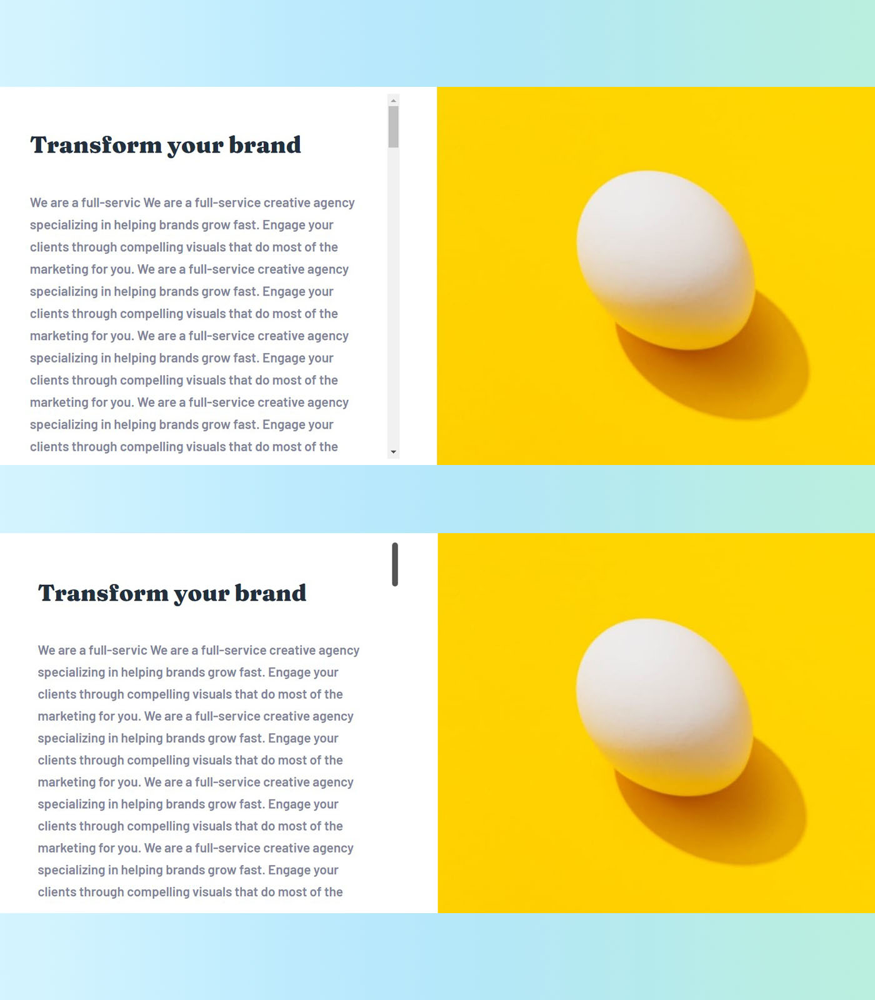

# Frontend Mentor - Sunnyside agency landing page solution

This is a solution to the [Sunnyside agency landing page challenge on Frontend Mentor](https://www.frontendmentor.io/challenges/sunnyside-agency-landing-page-7yVs3B6ef). Frontend Mentor challenges help you improve your coding skills by building realistic projects.

**<font size="4">友情提示：如果你想看中文解說，可以點[這裡](https://github.com/jubeatt/Sunnyside-agency-landing-page/blob/master/README-zh.md)🎉</font>**

## Table of contents

- [Overview](#overview)
  - [The challenge](#the-challenge)
  - [Screenshot](#screenshot)
  - [Links](#links)
- [My process](#my-process)
  - [Built with](#built-with)
  - [structural drawing](#structural-drawing)
- [What I learned](#what-i-learned)
- [Features](#features)
- [Issue Report](#issue-report)
- [Author](#author)
- [Acknowledgments](#acknowledgments)
- [Resources](#resources)

## Overview

### The challenge

Your challenge is to build this landing page and get it looking as close to the design as possible.

This challenge focuses on HTML & CSS, and a little bit of JavaScript.

About JS, you can choose to do it or not, depending on yourself.

You can use any tools you like to help you complete the challenge. So if you've got something you'd like to practice, feel free to give it a go.

Users should be able to:

- View the optimal layout for the site depending on their device's screen size
- See hover states for all interactive elements on the page

### Screenshot

**🖥 Desktop：**


**📱 Mobile：**


### Links

- Live Site URL: [Here](https://jubeatt.github.io/Sunnyside-agency-landing-page/)🥑

## My process

### Built with

- Mobile-first workflow
- Semantic HTML5 markup
- Flex-box
- Grid-box
- @keyframe (animation for the arrow)
- SCSS (preprocessor)
- BEM (methodology)
- Vanilla JavaScript (navigation on the mobile)
- [Reset.css](https://meyerweb.com/eric/tools/css/reset/)
- [jQuery](https://jquery.com/) (smooth scroll)
- [Google font](https://fonts.google.com/)
- [Font Awesome](https://fontawesome.com/v5/changelog/latest) (social-icon)

### Structural drawing


## What I learned

### Regarding the classes structure of BEM

- **Complex nested structure**

Let's quote some statements from [BEM by Example](https://sparkbox.com/foundry/bem_by_example)：

> If your component has child elements several levels deep, don’t try to represent each level in the class name. BEM is not intended to communicate structural depth. A BEM class name representing a child element in the component should only include the base/block name and the one element name.

As the statements saying, If we have several levels of child elements in a component, we should not try to write them in a BEM class name, for example:

```html
<figure class="photo">
  
  <figcaption class="photo__caption">
    description of the photo
    <blockquote class="photo__caption__quote">
      Don't include more than one child element in a class name
    </blockquote>
  </figcaption>
</figure>
```

So there should be only one `Element` under a `Block`.

```html
<figure class="photo">
  
  <figcaption class="photo__caption">
    description of the photo
    <blockquote class="photo__quote">That's it!</blockquote>
  </figcaption>
</figure>
```

Even if you didn't write out each level of the strucrute, you can still know the `img`, `caption`, `photo` are the elements of this component.

So when you are naming your class name, you can think about this: **which component should the element belong to?**, follow this rule and get a clear class name.

- **you don't have to follow the rules of BEM in each case**

Take the `header` part in this challenge to make an example:

```html
<header class="header">
  <h3 class="slogan">WE ARE CREATIVES</h3>
  <a class="arrow"></a>
</header>
```

In this case, `slogan` and `arrow` are not a dependency of the `header`, they can be existed by themself. (unless you regard `header` as a component), so it does not recommend to write like this:

```html
<header class="header">
  <h3 class="header__slogan">WE ARE CREATIVES</h3>
  <a class="header__arrow"></a>
</header>
```

It usually happens on the text part, so just need to write a Recognizable class name, there's no need to follow the rule every time.

### Use &lt;picture&gt; tag

`media query` is not the only way to make an image responsive, you can also use a `<picture>` of HTML.

for example, in this challenge we can use that:

```html
<picture>
  <source
    srcset="images/desktop/image-transform.jpg"
    media="(min-width: 760px)"
  />
  
</picture>
```

The browser will look for the first match images from the `<source>` at first, if there are no images match or the browser doesn't support `<picture>`, it will apply the image from ``.

Tips:

- you can use more than one `<source>` to separate different images
- Remember always set `` in the last, because it will ignore every `<source>` behind it.

More detail: [here](https://blog.bitsrc.io/why-you-should-use-picture-tag-instead-of-img-tag-b9841e86bf8b)

### Some setting of SVG

Because I didn't use SVG to set images before, so I'm not familiar on how to decorate it.

Here are the problems and solutions that I met:

- **Change the size of SVG**

Just select it and set it by using CSS:

```html

```

```scss
.logo {
  width: 150px;
}
```

- **Change the color of SVG**

There are two ways that I currently know can do it:

1. Change the attribute value of `fill` from the SVG file directly.


2. Write the SVG content into HTML first, and then change the attribute value of `fill` by CSS.

```html
<svg width="124" height="24" xmlns="http://www.w3.org/2000/svg">
  <path
    d="M5.857 18.708c1.638 0 2.995-.36 4.07-1.08 1.075-.721 1.613-1.769 1.613-3.144-.083-1.855-1.464-3.246-4.144-4.173l-1.44-.597c-.314-.1-.538-.198-.67-.298a.45.45 0 01-.198-.373c0-.414.273-.62.819-.62.678 0 1.182.347 1.513 1.043l3.698-1.044c-.893-2.22-2.614-3.329-5.162-3.329-1.522 0-2.788.398-3.797 1.193C1.15 7.08.645 8.116.645 9.39c0 .398.058.766.174 1.106.116.34.29.638.521.894.232.257.455.48.67.671.215.19.488.369.82.534.33.166.582.286.756.36.174.075.41.162.707.261l.422.15 1.49.546c.363.133.6.244.707.335a.449.449 0 01.16.36c0 .431-.404.647-1.215.647-1.191 0-1.903-.53-2.134-1.59L0 14.509c.463 2.8 2.416 4.2 5.857 4.2zm11.636 0c1.638 0 2.845-.63 3.623-1.888v1.615h5.112V5.366h-5.112v7.156c0 1.474-.505 2.21-1.514 2.21-1.026 0-1.539-.736-1.539-2.21V5.366h-5.112v7.653c0 3.793 1.514 5.69 4.542 5.69zm16.103-.273V11.28c0-1.475.504-2.212 1.513-2.212 1.026 0 1.54.737 1.54 2.212v7.155h5.111v-7.652c0-3.793-1.513-5.69-4.541-5.69-1.638 0-2.846.63-3.623 1.888V5.366h-5.113v13.069h5.113zm15.383 0V11.28c0-1.475.504-2.212 1.514-2.212 1.025 0 1.538.737 1.538 2.212v7.155h5.113v-7.652c0-3.793-1.514-5.69-4.542-5.69-1.638 0-2.846.63-3.623 1.888V5.366h-5.113v13.069h5.113zM64.958 24l8.289-18.634H67.91l-2.532 6.684-2.258-6.684h-5.584l5.435 11.802L59.944 24h5.014zm13.67-5.292c1.638 0 2.995-.36 4.07-1.08 1.076-.721 1.614-1.769 1.614-3.144-.083-1.855-1.465-3.246-4.145-4.173l-1.44-.597c-.314-.1-.537-.198-.67-.298a.45.45 0 01-.198-.373c0-.414.273-.62.819-.62.678 0 1.183.347 1.514 1.043l3.698-1.044c-.894-2.22-2.614-3.329-5.162-3.329-1.522 0-2.788.398-3.797 1.193-1.01.795-1.514 1.83-1.514 3.105 0 .398.058.766.173 1.106.116.34.29.638.522.894.231.257.455.48.67.671.215.19.488.369.819.534.33.166.583.286.757.36.173.075.41.162.707.261l.422.15 1.489.546c.364.133.6.244.707.335a.449.449 0 01.161.36c0 .431-.405.647-1.216.647-1.19 0-1.902-.53-2.134-1.59l-3.723.844c.464 2.8 2.416 4.2 5.857 4.2zm9.8-14.137c.91 0 1.613-.215 2.11-.646.495-.43.744-.977.744-1.64 0-.678-.24-1.23-.72-1.651C90.082.21 89.371 0 88.428 0c-.943 0-1.655.211-2.135.634-.48.422-.72.973-.72 1.652 0 .662.249 1.209.745 1.64.497.43 1.2.645 2.11.645zm2.556 13.864V5.366H85.87v13.069h5.113zm7.74.273c1.737 0 2.977-.63 3.722-1.888v1.615h5.112V.472h-5.112v6.534c-.745-1.275-1.985-1.913-3.723-1.913-1.753 0-3.214.642-4.38 1.926-1.166 1.283-1.75 2.91-1.75 4.882 0 1.97.584 3.598 1.75 4.882 1.166 1.283 2.627 1.925 4.38 1.925zm1.39-3.9c-.729 0-1.312-.274-1.75-.82-.439-.547-.658-1.243-.658-2.087 0-.845.215-1.54.645-2.087.447-.547 1.034-.82 1.762-.82s1.311.273 1.75.82c.438.546.657 1.242.657 2.087 0 .844-.219 1.54-.657 2.087-.439.546-1.022.82-1.75.82zm16.698 3.9c2.597 0 4.624-.754 6.08-2.26l-2.11-2.833c-1.042.845-2.217 1.267-3.524 1.267-.992 0-1.799-.224-2.42-.67-.62-.448-.93-.879-.93-1.293h9.604c.083-.298.124-.687.124-1.167 0-2.054-.674-3.677-2.022-4.87-1.349-1.193-3.073-1.789-5.175-1.789-2.25 0-4.028.671-5.335 2.013-1.307 1.341-1.961 2.956-1.961 4.844 0 1.938.69 3.549 2.072 4.833 1.382 1.283 3.247 1.925 5.597 1.925zm2.208-8.149h-5.112c.033-.613.298-1.08.794-1.404.496-.323 1.084-.484 1.762-.484.678 0 1.266.165 1.762.497.497.331.761.795.794 1.391z"
    fill="#FFF"
    fill-rule="nonzero"
  />
</svg>
```

```scss
svg path {
  fill: pink;
}
```

### The difference between nth-child and nth-of-type

In order to do this:


My first idea is to modify **the odd number of elements**, so it will need to use `nth-child` or `nth-of-type` to achieve it.

But in my case, it can only use `nth-of-type` to do it, because my HTML looks like this:

```html
<section class="feature" id="feature">
  <h2 class="hide">Feature</h2>

  <!-- component-feature-card-->
  <div class="feature-card">
    <!-- Omission -->
  </div>

  <div class="feature-card">
    <!-- Omission -->
  </div>

  <div class="feature-card">
    <!-- Omission -->
  </div>
</section>
```

If I write CSS like this:

```scss
.feature-card:nth-child(odd) {
  ...
}
```

Actually, The elements were selected from the selector will be :


But if it is:

```scss
.feature-card:nth-of-type(odd) {
  ...
}
```

The result will be:


The main point is no matter `nth-child` or `nth-of-type`, both are based on their position in a group of siblings. so **the group includes whole siblings of tags, not just the class names**.

And the difference between them is:

- `nth-child`: Regardless of type(HTML tag)
- `nth-of-type`: Particular type(HTML tag)

Next time when you use these pseudo-class selectors, be sure you know what's the difference between them and which one you should use.

### What case should I use % unit?

Sometimes I would be mess up by using absolute units or relative units since my experience of creating RWD is not very much.

So here are some Experiences I learned after I finished this challenge:

- If a block should be fluid with the width, its `width` should be set by %.

- Regarding the `margin`, `padding` between the texts or blocks, it depends on your goal.  
  If you set % for them. when the `width` becomes larger, the spacing between them will be also increased, so I think there is no right answer to answer this question, it all depends on the end goal.

- Some blocks may have the same `padding` from each side, in this case, you need to know one thing.  
  when the `width` is increasing, the content inside the block will get more close to the inside.  
   so you can think about this: **Is The content get larger by itself when the width is increased?** If the answer is NO, the spacing between the content and the block will be larger.

### Make the text content more flexible

You can make good use of `max-width` / `max-height` to limit the size of the text area. It can prevent your text look too long or too short when the block is very big or small. or in the reverse case, the text influence the block, make the block looks too big.

example1:

<font size="2">💡 remark：This picture was taken by `759px` width. (the Maximum of the mobile version)</font>


example2:

<font size="2">💡 remark：This picture was taken by `759px` width. (the Maximum of the mobile version)</font>


### Use object-fit to prevent your picture get deformation

No chit-chat, let's just see a picture:

<font size="2">💡 remark：This picture was taken by `765px` width.</font>


`object-fit` is a new property of CSS3, to see more usage click [here](https://css-tricks.com/almanac/properties/o/object-fit/).

<font size="2">⚠ Warning：IE doesn't support this property</font>

## Features

### No limit content

I use `max-height` and `overflow` for some parts of the content block, so even you have a lot of content, it still looks fine, no need to worry about it.


Code:

```scss
&content {
  max-height: 400px;
  overflow: auto;
}
```

### Customize scrollbar

The default scrollbar of the browser seems not really well (just my feeling 😅), so it actually can be changed by using CSS.



<font size="2">⚠ Warning： This method can be only used for the WebKit browser (Chrome or Safari), so if you want to support each browser, it recommends using JavaScript.</font>

Code:

```scss
&::-webkit-scrollbar-track {
  border-radius: 10px;
  background-color: transparent;
}

&::-webkit-scrollbar {
  width: 8px;
  background-color: transparent;
}

&::-webkit-scrollbar-thumb {
  border-radius: 10px;
  background-color: #555;
}
```

If you want learn more detail, check this [site](https://cssdeck.com/labs/css3-webkit-vertical-scrollbars).

### Smooth scroll


There's one easy way to achieve it. you can use `scroll-behavior: smooth`, which is the property of CSS, like this:

```scss
html {
  scroll-behavior: smooth;
}
```

<font size="2">⚠ Warning： This method doesn't support Safari and IE.</font>

Consider that the compatibility of browsers, It's more stable by using JavaScript.

So here I using jQuery to do this since it's easier for handling the animation effect, but you can also use vanilla JavaScript if you prefer that. (As Long as There's Love, It Doesn't Matter?😂)

Code:

```javascript
// get element
let arrowBtn = $('.arrow')
// except the "logo" anchor and the "arrow" anchor
let link = $('a[href="#"]:not(".arrow")')

// event binding
arrowBtn.on('click', function (e) {
  // send event object to the function
  scrollToFeatureSection(e)
})
link.on('click', function (e) {
  // send event object to the function
  scrollToTop(e)
})

// smooth scrolling
function scrollToTop(e) {
  // prevent default action of <a>
  e.preventDefault()
  // move to top
  $('html, body').stop().animate({ scrollTop: 0 }, 800)
}

function scrollToFeatureSection(e) {
  // prevent default action of <a>
  e.preventDefault()
  // get position of the feature section
  let target = document.getElementById('feature').offsetTop
  // move to the position
  $('html, body').stop().animate({ scrollTop: target }, 800)
}
```

## Issue Report

### Regarding the images

I found there's a problem, when the viewport is between about `500px` to `760px`, some images seems not well on responsive effect.

You can fix this problem by using desktop images instead of mobile images.

Check this picture:

<font size="2">💡 remark：This picture was taken by `759px` width. (the Maximum of the mobile version)</font>


### A little bit flaw of the design

I Just found it unknowingly😂, there is some text that seems not to center align.


## Author

- Website - [Jim's blog](https://jubeatt.github.io/)
- Frontend Mentor - [Jim](https://www.frontendmentor.io/profile/jubeatt)
- Facebook - [薛裕正](https://www.facebook.com/profile.php?id=100003593580513)

## Acknowledgments

First of all, thanks to every who read this README, after all, it's took me a lot of time to finish it. So I very much appreciate that you're willing to take the time on reading this.

I'll be delighted if you get some new techniques from here.

Of course, always feel free to give me feedback if you found anything wrong or you have any suggestions.

You can send an [mail](mailto:jimdevelopesite@gmail.com) to me or just contact me directly.

In the end, I still thank the author who creates Front Mentor, It's not only the web design and practicing I learned from here but also learned much relative knowledge of front-end.

It gives me more rewards beyond my expectations even though this is just my third challenge.

Maybe it's a long way to go on the front-end, but I'll keep going on this, and I hope I can finish the challenges that I want to do in the future.

## Resources

[css3-webkit-vertical-scrollbars](https://cssdeck.com/labs/css3-webkit-vertical-scrollbars)  
[BEM by Example](https://sparkbox.com/foundry/bem_by_example)  
[Why You Should Use Picture Tag Instead of Img Tag](https://blog.bitsrc.io/why-you-should-use-picture-tag-instead-of-img-tag-b9841e86bf8b)
[object-fit | CSS-Tricks](https://css-tricks.com/almanac/properties/o/object-fit/)
